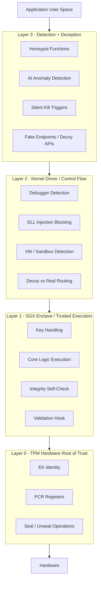

# Architecture Layouts (4 Layers)

```mermaid
flowchart TB
  A[Application User Space] --> L3

  subgraph L3[Layer 3 - Detection + Deception]
    L3a[Honeypot Functions]
    L3b[AI Anomaly Detection]
    L3c[Silent Kill Triggers]
    L3d[Fake Endpoints / Decoy APIs]
  end

  L3 --> L2

  subgraph L2[Layer 2 - Kernel Driver / Control Flow]
    L2a[Debugger Detection]
    L2b[DLL Injection Blocking]
    L2c[VM / Sandbox Detection]
    L2d[Decoy vs Real Routing]
  end

  L2 --> L1

  subgraph L1[Layer 1 - SGX Enclave / Trusted Execution]
    L1a[Key Handling]
    L1b[Core Logic Execution]
    L1c[Integrity Self-Check]
    L1d[Validation Hook]
  end

  L1 --> L0

  subgraph L0[Layer 0 - TPM Hardware Root of Trust]
    L0a[EK Identity]
    L0b[PCR Registers]
    L0c[Seal / Unseal Operations]
  end

  L0 --> HW[Hardware]
```
